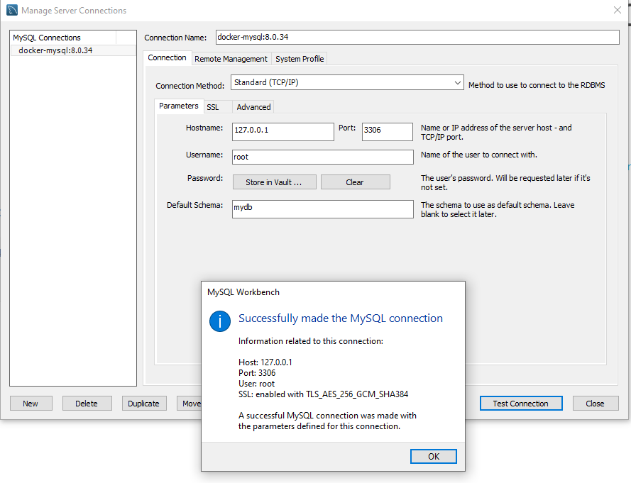

# Coursera Advanced Data Modeling Course

## Syllabus
- [Week 1: Data modeling and management](./notes.md#week-1-data-modeling-and-management)
- [Week 2: Data warehousing](https://github.com/linomp/data-modeling/blob/main/notes.md#week-2-data-warehousing)
- Week 3: Advanced Data Analytics
- Week 4: Model and Analyze Data

## Setup

1. Bring up MySQL server:
    - Clone the repo and run this:
        ```
        docker-compose up -d
        ```

2. Install MySQL Workbench (GUI): 
    - Download from [here](https://dev.mysql.com/downloads/workbench/) (install only the client, not the server)


3. Configure & test the connection 
    - It should look like this:

        

4. Once everything is set up, you can pack everything in a script and run it:
    ```cmd
    echo docker-compose up -d ^&^& "C:\Program Files\MySQL\MySQL Workbench 8.0 CE\MySQLWorkbench.exe" > start_services.bat
    start_all.bat
    ```
    
## Resources
- [Course website](https://www.coursera.org/learn/advanced-data-modeling)
- [MySQL Official Docker Image](https://hub.docker.com/_/mysql)
- [MySQL Workbench + Docker tutorial](https://www.youtube.com/watch?v=kphq2TsVRIs)
