# Course Notes

## Week 1: Data modeling and management

### DB Normalization recap
- DBs that don't follow normalization process often give rise to anomalies
    - insertion anomaly: new data requires insertion of additional data
    - update anomaly: update of a record results in further updates
    - deletion anomaly: deletion of a record deletes more than one dataset

- 1NF: enforces data atomicity and eliminates repeating data groups.
    - only one instance of a value per column
    - example: orders table with a products column that contains multiple products. Solution: keep a products table, a clients table, and an orders table with 2 foreign keys (client ID and product ID)

- 2NF: enforces data atomicity and eliminates partial dependencies
    - all non-key attribute must be determined by using all the components of a composite key (if it uses any less, it's a partial dependency)
    - example of non-compliant table: deliveries table that contains order ID and order date, but the order date is dependent on the order ID, not the entire composite key (should exist only in the orders table)

- 3NF: enforces data atomicity and eliminates transitive dependencies
    - table must adhere to 1NF and 2NF before it can be 3NF
    - transitive dependency is when a non-key attribute is dependent on another non-key attribute
    - example: orders table that contains city and zip code. Zip code is dependent on city. they are both non-key attributes, so this is a transitive dependency.  One solution is to keep only ZIP code in the orders table, and create a new table with city and ZIP code.

## Week 2: Data Warehousing

### Data Warehouse
- A DW is a centralized data repository that aggregates, stores, and processes large amounts of data from multiple sources. Users can then query this data to perform data analysis.

- 4 Characteristics:
    - Subject-oriented: they provide information on chosen subjects or topics.
    - Integrated: they integrate data from a range of different sources.
    - Non-volatile.
    - Time variant: they aggregate data over a long period of time to measure change.

- The architecture of the data warehouse consists of the following components:
    - Data sources: which consist of the data that the organization relies on for its insights.
    - Data staging area: this is where data is prepared for analytics through the ETL or extract transform and load process.
    - The data warehouse itself where data is stored.
    - Data marts: These are subject-oriented databases that meet the demands of specific users. 

        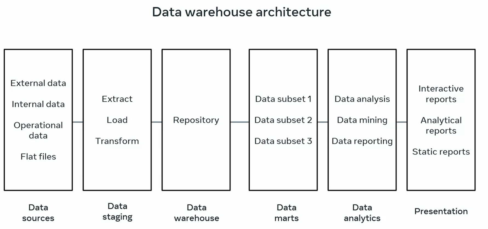

### Dimensional Data Modeling

ERD & Object Oriented data models are built for transactional systems, but for building data warehouses we need them to be optimized for access and analytical queries

### Facts & Dimensions
- Dimensions: Data elements that define a **context** (or perspective) for the measures. 
    
    Examples: time, location. 
    
    This supports the 'time' perspective in questions like "how many sales were made in the **last 3 months in the US**?"

- Facts: Quantifiable measures that are of interest to the business. 

    Examples: sales, cost, profit, etc.
    - Stored measures: aggregated measures stored in the warehouse
    - Calculated measures: data calculated using stored measures

### Structure of a dimensional data model
- Dimensional data model consists of Facts & Dimensions tables.

- Fact tables contain the measures of interest to the business. They are the central tables in a dimensional data model. They contain foreign keys to the dimension tables, and they are usually large and often partitioned to improve performance.

    **Example:**

    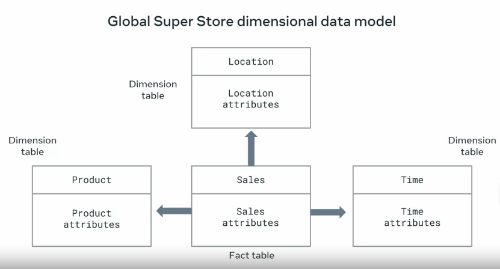

    With this data model, they can find out:
    - avg **sales** per **year**
    - avg **sales** per **year** per **product**
    - avg **sales** per **city** per **year**
    - pattern: _fact_ per _dimension_ per _dimension_ 

### Best Practices for designing

- Focus on specific business activities to examine
- Identify all useful dimensions: those that give the most meaningful and useful context to the measures
- organize data in a way easy to understand, access and query

### Design methods: Schemas

- **Star schema**: fact table in the middle, dimension tables around it. 

    **Pro**: Simplest schema, easy to understand and query. 
    
    **Con**: data redundancy

    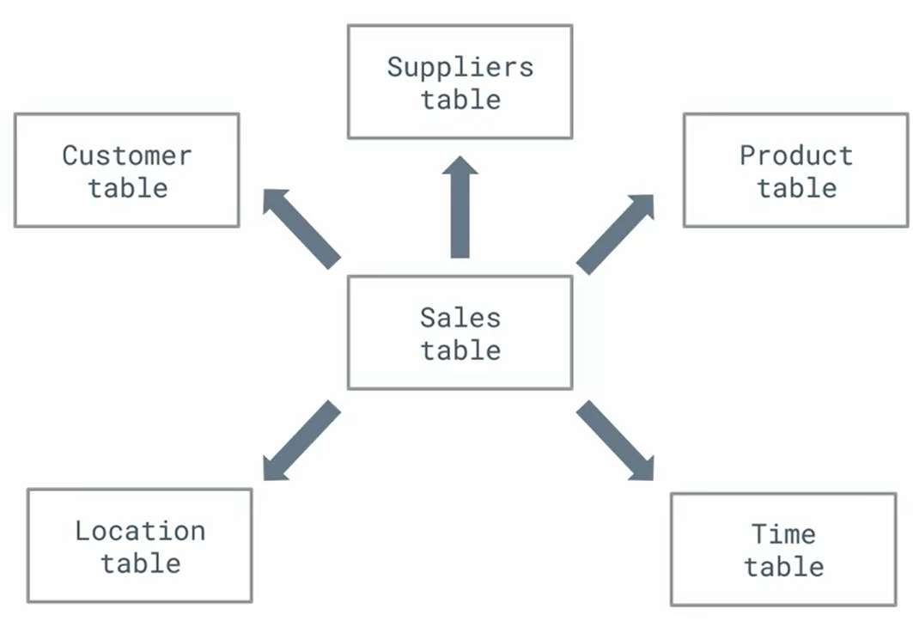

- **Snowflake schema**: fact table in the middle, dimension tables around it, but some of the dimension tables are normalized. This is useful when the dimension tables are large and have a lot of attributes.

    Best approach for normalization: group dimensions into multiple simple sub-dimensions tables.

    **Pro**: eliminate data redundancy

    **Con**: more complex to query, more joins, and more foreign keys needed

    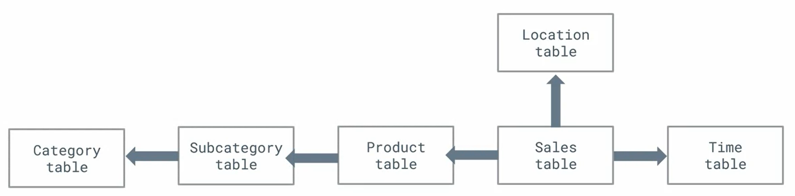

### OLAP Cubes

To perform effective data analysis on OLTP databases, you need to restructure your data in Online Analytical Processing (OLAP) database systems that are created mainly for data analysis. Key advantages of OLAP database systems include the following:

- They facilitate multidimensional analysis.

- They provide tools for easy access and filtering of dimensional data.

- They support fast retrieval of massive amounts of data.

**Example:**

```
Global Super Store sells furniture, office supplies and technology products around the world. They want to investigate the sales performance of different product categories over the last four years across four different European countries: France, Germany, Italy and the UK.
```

*Basic Solution:*

- Create 3 tables, each one showing total sales in the context of a single dimension:

    - Sales in the context of the Time dimension (Year – 2019, 2020, 2021 and 2022).

    - Sales in the context of the Location dimension (Country - United Kingdom, Italy, France and Germany).

    - Sales in the context of the Product dimension (Category - Furniture, Office Supplies and Technology).

- This kind of analysis does not provide any deep insights into your data. And it is not that easy to investigate and compare data based on multiple dimensions, (which is required to facilitate more interesting information for the business decision makers). 

*Better Solution:* 

- Merge the three dimensions (Time, Location and Product) together in a multidimensional OLAP cube:


    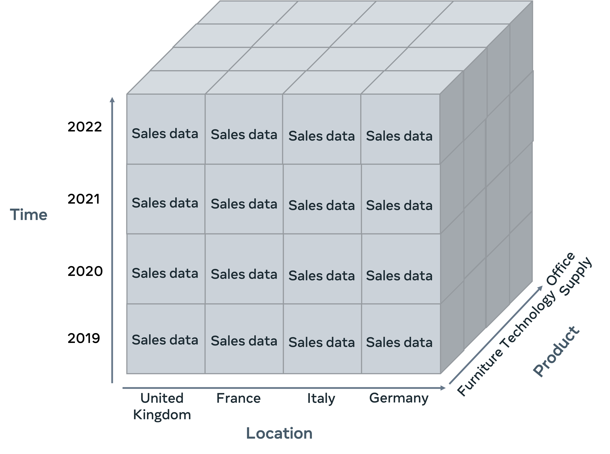

- This supports operations like:
    - **Slice**: to see data for a single dimension. 
    
        Example question: “How have sales in the furniture category performed over the previous four years in each country?”

        We can slice the cube to focus only on the furniture category of the product dimension:

        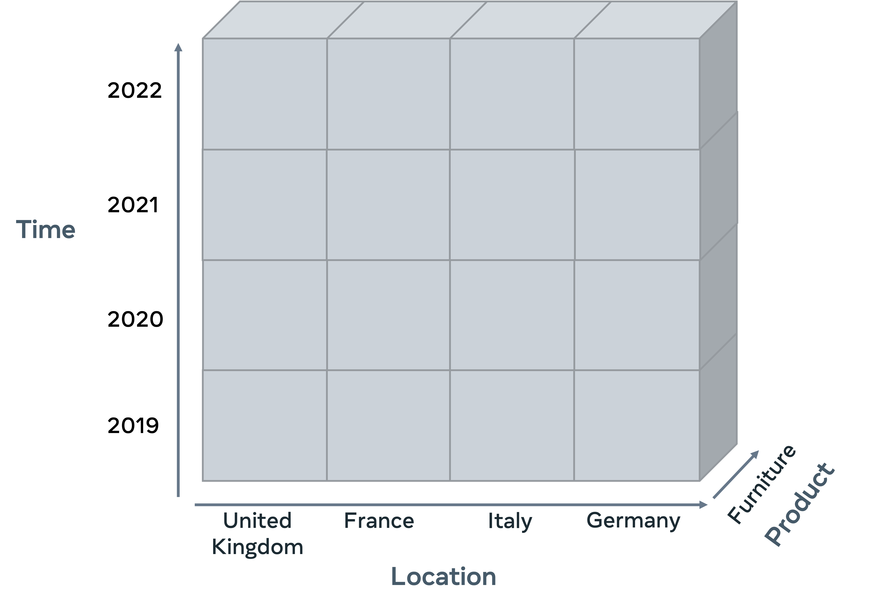

        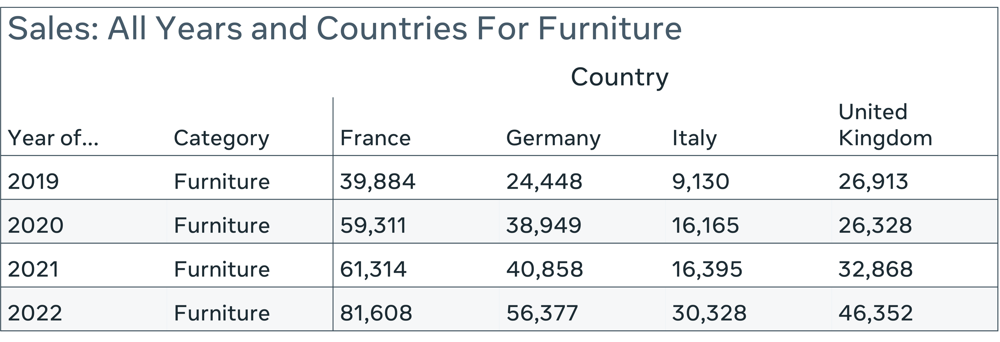

    - **Pivot**: provides an alternative view of data by rotating the axes of the cube. 

        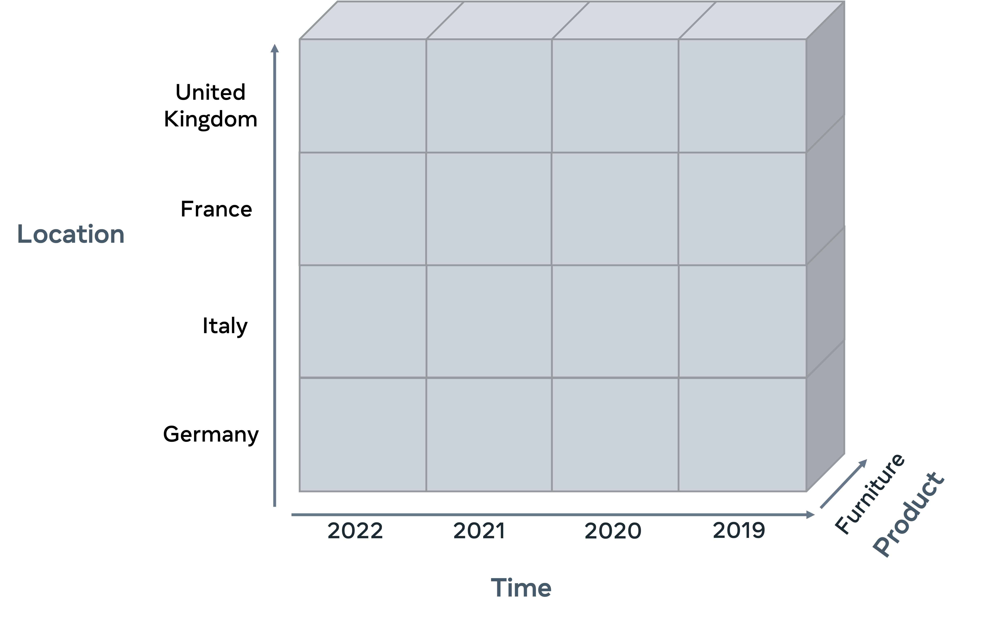

        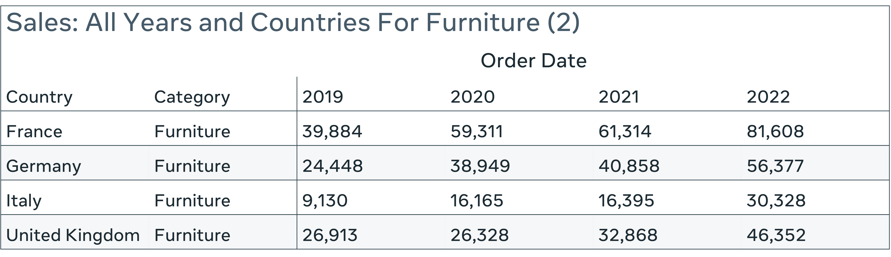

    - **Dice**: to emphasize two or more dimensions. 
    
        Example question: “How have sales of furniture and technology products performed over the last two years in France and Germany?”

        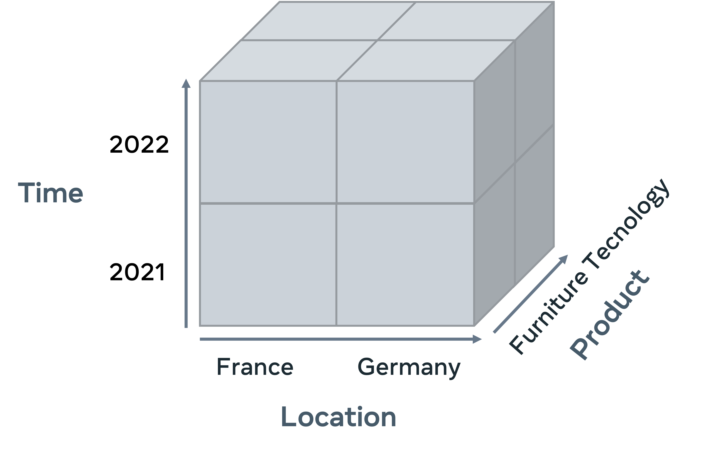

        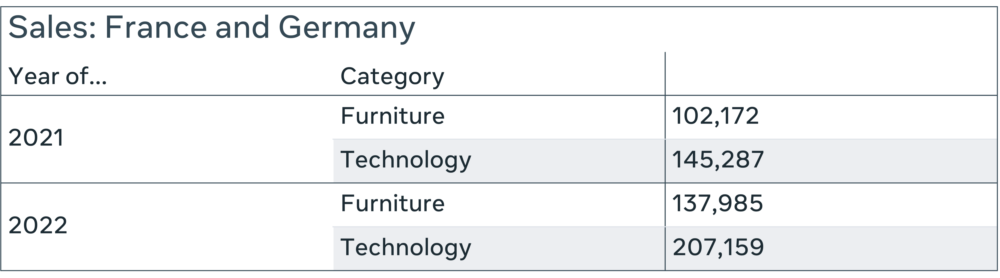

### Dimensional Modeling in Practice

- 4 key steps:
    - Identify the business process to analyze
    - Identify the granularity
        - what detail is required for the data warehouse to address the problem?
        - waht's the lowest level of detail required?
        - example, global super store: for time dimension, they require yearly & daily sales data.   And for location dimension, they requires global and local sales data.
    - Identify the dimensions
        - in what context do we need to analyze the business data?
    - Identify the facts
        - what do you want to measure?

- Then you can create the schema

### Dimensional Model Example

- Step 1: Identify key information 

    - Identify the grain: 
    
        Global Super Store is an international company that has been operating for several years. So, they need to investigate their sales at the following levels of granularity:

        - Region, country and city.
        - Year, quarter, month, day or event levels.
        - Category, subcategory and items.

    - Identify the facts: 
        
        Global Super Store must investigate all the measures that impact the sales including:

        - The buy and sale prices of all products.
        - The quantity sold of each product.
        - The shipping cost of each product. 

    - Identify the dimensions: 

        Global Super Store must examine the measures against the following key dimensions:

        - Location.
        - Time.
        - Product.
        - Customers.
 
- Step 2: Create a star schema

    The following ER diagram illustrates a suitable Star schema for the Global Super Store dimensional model.
   

    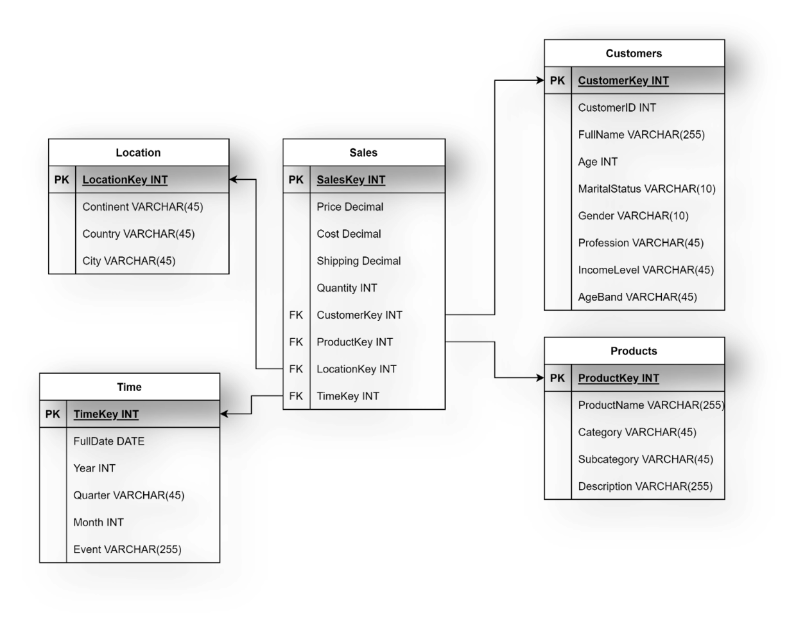

  
- Step 3: Create a snowflake schema

    The following ER diagram illustrates a suitable Snowflake schema for Global Super Store dimensional model.

    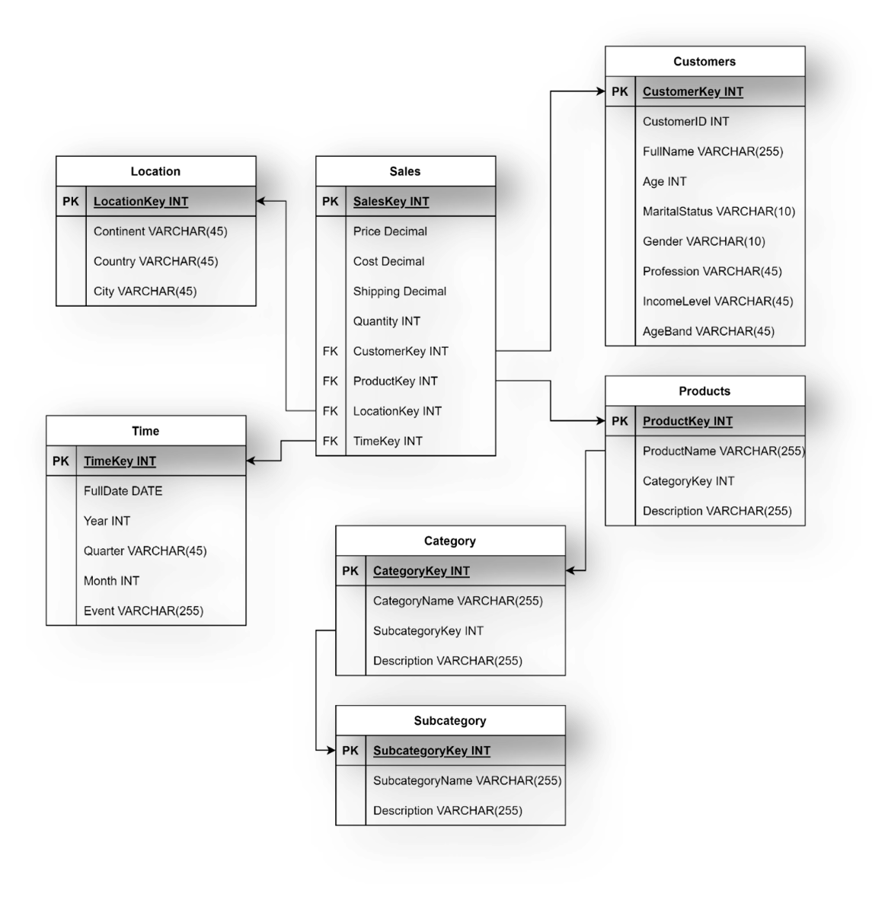

### Resources
- [Snowflake Schemas vs Star Schemas: 5 key differences](https://www.integrate.io/blog/snowflake-schemas-vs-star-schemas-what-are-they-and-how-are-they-different/)


## Week 3: Data Analytics